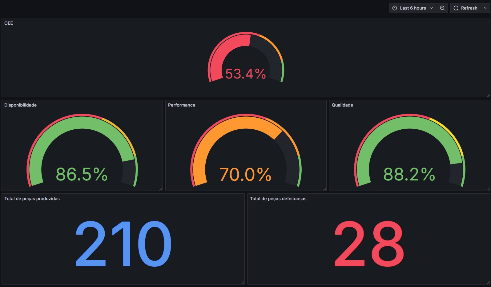

# Desafio Técnico ECO – Monitoramento de Eficiência OEE

O objetivo deste projeto é demonstrar a criação de uma solução completa de ingestão e visualização de dados industriais em tempo real. Utilizando o protocolo MQTT, os dados são captados, armazenados em um banco de dados PostgreSQL e apresentados em um dashboard com indicadores operacionais (KPIs) calculados no Grafana.

---

## ⚙️ Como Executar o Projeto

> Pré-requisitos: Docker e Docker Compose instalados

1. Clone o projeto no seu ambiente local:
```bash
git clone https://github.com/seu-usuario/desafio-tecnico-backend.git
cd desafio-tecnico-backend
```

2. Copie o arquivo de variáveis de ambiente:
```bash
cp .env.example .env
```

3. Preencha o arquivo .env com as credenciais fornecidas.

4. Inicie os containers com:
```bash
docker-compose up --build
```

5. Acesse:

- Grafana: http://localhost:3000
- Login: admin | Senha: admin
- MQTT Explorer: para visualizar o tópico ECOPLUS/EX-001/dados (opcional)

---

## 📊 Indicadores no Dashboard



O dashboard no Grafana apresenta os seguintes KPIs:

- Total de peças produzidas: Soma de pecas_produzidas
- Total de peças defeituosas: Soma de pecas_defeituosas
- Qualidade (%): (pecas_boas / pecas_produzidas) × 100
- Performance (%): (pecas_boas / tempo_ligado_em_horas) ÷ 100 × 100
- Disponibilidade (%): (tempo ligado ÷ tempo total do período)
- OEE (%): Disponibilidade × Performance × Qualidade

> As consultas utilizam o filtro de tempo padrão:

```sql
WHERE $__timeFilter(datahora)
```

---

## 📁 Organização dos Arquivos

- README.md: instruções e documentação (este arquivo)
- grafana/dashboard_oee.json: exportação do dashboard criado no Grafana
- imagens/: pasta com prints do dashboard para ilustração
- ingestion/main.py: script de ingestão que escuta o MQTT e grava no banco
- .env: variáveis de ambiente (não incluído no repositório)
- docker-compose.yml: orquestração dos containers

---

## 🧠 Análise dos Dados
Com base nas leituras do período testado:

- A qualidade das peças foi elevada (88,2%), indicando baixo índice de defeitos.
- A performance ficou abaixo da meta de 100 peças/hora, sugerindo gargalos ou lentidão no processo.
- A disponibilidade foi de cerca de 86%, o que indica que a máquina esteve inativa por 14% do tempo monitorado.
- O OEE final calculado ficou por volta de 53%, valor abaixo do ideal, o que pode ser utilizado como alerta para ações corretivas.

--- 

> Correção: Dashboard do Grafana foi corrigido cores laranja para amarelo.